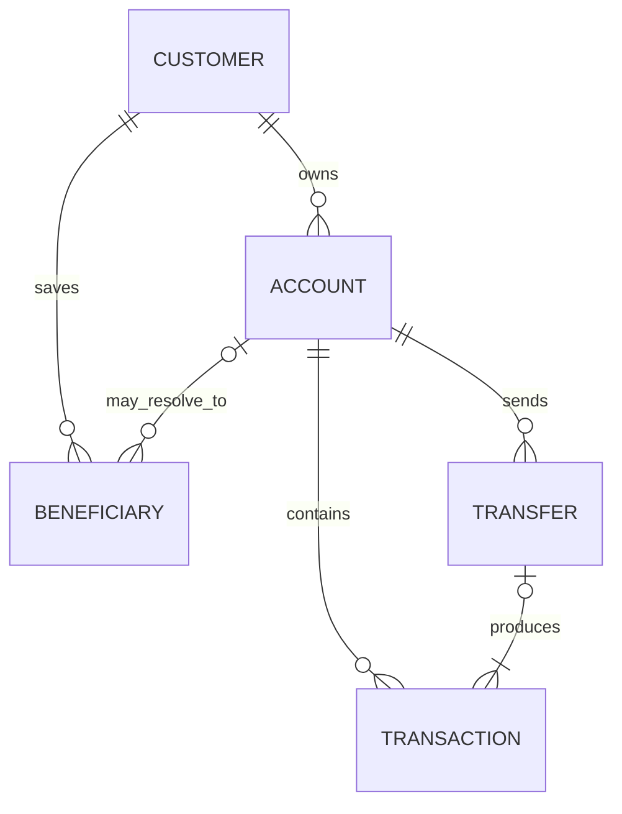

# Raksul-bank

## Overview

A personal banking dashboard built with Nuxt 4, Vue 3 and TypeScript. It uses a mock HTTP API and browser-local IndexedDB persistence, with fictional data and no real banking connection.

## What I Built

- Accounts and Overview with owned accounts, masked account numbers, USD balances, active/frozen status and recent activity.
- Transaction explorer with text, account, direction, type, status and inclusive UTC date filters, API pagination and URL state.
- Individual transaction details in a responsive drawer, available from Transactions and Recent activity.
- Responsive navigation, keyboard focus management, loading/error/retry/empty states and confirmed demo reset.
- Typed API client and MSW handlers for customer, accounts, transaction queries, beneficiaries and reset.
- Deterministic seed data, validated persistence and atomic repository updates.
- Exact integer-cent arithmetic, atomic transfer execution and persistent idempotency.
- Transfer details, masked review, explicit confirmation and completion receipt for own accounts and saved beneficiaries.

Transfers are simulated and complete in one request after IndexedDB commits. No real funds move.

## Deliberately Left Out

Real authentication, authorization, OTP/MFA, currency conversion, fees, scheduled transfers, overdraft, payment rails, settlement, fraud detection and ledger reconciliation are outside this demo's scope. There is no implemented production banking backend or real customer data; the Nitro API boundary is ready to connect to a compatible backend.

## Technology Stack

Nuxt 4 (SSR with Nitro), Vue 3, strict TypeScript, Nuxt file-based routing (Vue Router 5), Nuxt UI 4, Tailwind CSS 4, TanStack Vue Query, Zod, MSW and IndexedDB. Tests use Vitest, Vue Test Utils, fake-indexeddb and Playwright/Chromium.

Dependencies are pinned in `package-lock.json`. Nuxt owns application startup, routing, layouts, head metadata and server rendering. Vite is used internally by Nuxt and separately for isolated component tests.

## Getting Started

Use Node.js 24.14.0 (pinned in `.nvmrc`) and npm 11.

```bash
nvm install
nvm use
npm ci
npm run dev
```

Open the URL printed by Nuxt, normally `http://127.0.0.1:3000`. `npm ci` runs `nuxt prepare` to generate Nuxt types.

To preview the production Node/Nitro server:

```bash
npm run build
npm run preview
```

No API keys or database server are required for the default demo. Copy `.env.example` to `.env` to override settings. `NUXT_PUBLIC_ENABLE_MOCKS=true` enables browser MSW and IndexedDB. Nuxt renders the shell and loading states on the server; demo queries start after hydration and worker startup because browser-local data cannot be read during SSR.

For backend integration and data SSR:

```dotenv
NUXT_PUBLIC_ENABLE_MOCKS=false
NUXT_API_BASE_URL=https://your-backend.example/api
```

The upstream root includes the backend API prefix. Both browser and SSR calls use `/api/*`; Nitro forwards them to that root, preserving query strings and the incoming cookie/authorization context. The upstream URL stays server-only. Accounts, recent activity and valid transaction queries are prefetched during SSR and hydrated into a request-local Vue Query cache. Reset is hidden and its server endpoint is blocked in backend mode.

Restart development/preview after changing `.env`. For deployment, set runtime environment variables and run `npm start` after building; the built server does not load `.env` itself. `PORT`/`HOST` (or Nitro equivalents) configure its listener. Use a Node/Nitro-capable host, not a static `dist/` upload. Serve over HTTPS in deployment. Missing backend configuration returns an explicit 503. Changing modes does not delete existing IndexedDB demo data.

See [Nuxt migration and backend handoff](docs/nuxt-migration.md) for contracts, SSR boundaries and verification.

## Available Scripts

| Command                  | Purpose                                                   |
| ------------------------ | --------------------------------------------------------- |
| `npm run dev`            | Start the local development server.                       |
| `npm run build`          | Typecheck and build Nitro into `.output/`.                |
| `npm run preview`        | Preview the production server locally.                    |
| `npm run typecheck`      | Check application and tooling types.                      |
| `npm run lint`           | Run ESLint.                                               |
| `npm run format:check`   | Check Prettier formatting.                                |
| `npm run test -- --run`  | Run the unit/component suite once.                        |
| `npm run test:ssr`       | Verify the built SSR server with a local backend fixture. |
| `npm run test:e2e`       | Build and run Chromium demo/backend fixture checks.       |
| `npm run test:e2e:built` | Run Chromium checks against an existing build.            |
| `npm run test:all`       | Run unit tests, build, SSR and browser checks.            |
| `npm start`              | Run `.output/server/index.mjs` in deployment.             |

## Architecture Overview

```text
Demo: Nuxt UI → typed API client → browser MSW → use case → repository port → IndexedDB
Backend: Nuxt SSR/browser → typed API client → Nitro /api/* → configured backend
```

## Project Structure

| Directory                          | Responsibility                                                                                |
| ---------------------------------- | --------------------------------------------------------------------------------------------- |
| `src/app.vue`, `src/app.config.ts` | Nuxt root and UI theme configuration.                                                         |
| `src/app/config/`                  | Validated runtime configuration.                                                              |
| `src/layouts/`, `src/plugins/`     | Nuxt layout, request-scoped API/query plugins and payload codecs.                             |
| `server/api/`                      | Same-origin backend forwarding boundary.                                                      |
| `src/pages/`                       | Nuxt file-based route pages.                                                                  |
| `src/features/`                    | Account, transaction and transfer UI/queries, recent activity and demo reset.                 |
| `src/contracts/`                   | Shared API/query types and the public banking client interface; no implementation imports.    |
| `src/domain/`                      | Banking entities, money, masking and pure transfer rules.                                     |
| `src/use-cases/`                   | Repository contract, customer scoping, transaction queries and atomic transfer orchestration. |
| `src/data/`                        | HTTP client, MSW handlers, seed, persistence validation and IndexedDB adapter.                |
| `src/shared/`                      | Theme, async states, money display and masked account numbers.                                |
| `src/tests/`                       | Domain, data/API and component tests.                                                         |
| `docs/adr/`                        | Architecture decision records.                                                                |

MSW translates HTTP requests and responses. Use cases own customer scoping and filtering. Vue components do not import repositories or seed data. Domain code is independent of Vue, HTTP and persistence. ESLint checks these import boundaries.

Shared query/response shapes live in `src/contracts/transactions.ts`; pagination metadata lives in `src/contracts/pagination.ts`. API clients, use cases and UI import those types directly from their defining modules. `src/contracts/banking.ts` defines the public `BankingApi` interface, implemented by the HTTP factory and used by the injected context. Contracts use type-only imports from domain/other contracts. Domain entities stay in `domain/`; privileged persistence state stays with the repository port. `ApiError` belongs to `data/api/apiError.ts`, so UI and SSR payload handling do not import the HTTP factory just to identify errors. Do not re-export contracts through client or use-case implementations.

## Data Model

The seed contains one fictional customer, three owned accounts (active checking, active savings and frozen checking), two hidden internal recipient accounts, six beneficiaries, 100 transactions across March–August 2026 and six completed own-account transfers.

| Entity              | Main fields and relationships                                                                                                                                                             |
| ------------------- | ----------------------------------------------------------------------------------------------------------------------------------------------------------------------------------------- |
| Customer            | ID and names; owns accounts and beneficiaries.                                                                                                                                            |
| Account             | ID, owner, display name, type, account number, USD currency, balance in cents, active/frozen status and creation timestamp.                                                               |
| Transaction         | ID, account ID, optional transfer ID, direction, type, positive amount in cents, currency, status, description, counterparty and timestamp.                                               |
| Beneficiary         | ID, customer ID, name, bank, account number, currency and optional internal account ID.                                                                                                   |
| TransferDestination | An owned account, an internal recipient account with a recipient snapshot, or an external recipient snapshot.                                                                             |
| Transfer            | ID, idempotency key, request hash, source, destination, amount, currency, reference, status and timestamps. Completed transfers retain the request fingerprint and recipient destination. |



The diagram shows the demo's current customer and its account ownership projection. Hidden recipient accounts have owner IDs outside that customer. A transfer destination is either an account reference or an immutable recipient snapshot; historical transfers do not depend on a beneficiary's current name. Non-transfer card/cash/fee/interest activity has no transfer ID. The persisted snapshot includes hidden accounts, but customer API projections exclude them.

Money uses safe integer minor units: `$10.50` is `1050` cents. Transaction direction supplies the debit/credit sign. Aggregate balances use BigInt, and formatting preserves exact cents. Account numbers are masked in the visible UI.

Seed balances reconcile to fixed opening balances plus completed activity. Pending and failed entries do not change balances. Total balance includes frozen accounts; active and frozen balances are shown separately. There is no holds or overdraft model.

## Mock API and Persistence

| Method | Endpoint                     | Response                                            |
| ------ | ---------------------------- | --------------------------------------------------- |
| GET    | `/api/customer`              | Current customer.                                   |
| GET    | `/api/accounts`              | Customer-owned accounts, including frozen accounts. |
| GET    | `/api/accounts/:accountId`   | Owned account or 404.                               |
| GET    | `/api/transactions`          | Filtered activity and pagination.                   |
| GET    | `/api/beneficiaries`         | Current customer's beneficiaries.                   |
| POST   | `/api/transfers`             | Completed receipt; requires an idempotency key.     |
| GET    | `/api/transfers/:transferId` | Customer-scoped completed receipt or 404.           |
| POST   | `/api/demo/reset`            | 204 after restoring the seed.                       |

Transaction queries accept `accountId`, `query`, `direction`, `type`, `status`, `dateFrom`, `dateTo`, `page` and `pageSize`. Dates are inclusive UTC calendar dates. Results are scoped before filtering/counting and sorted newest first. Pagination defaults to 20 entries; the maximum page size is 100.

The client passes cancellation signals to fetch and surfaces structured API errors. In demo mode, MSW starts after hydration and before API queries are enabled. Unhandled `/api/` requests fail visibly. Successful response types are trusted contracts of the controlled mock API, not independently validated client payloads.

### Persistence

The IndexedDB database `raksul-bank` stores one versioned snapshot in object store `banking-state`, key `current`. It includes the customer, accounts, transactions, transfers and beneficiaries. Zod validates its structure and relationships.

The repository initializes missing data and recovers structurally invalid or incompatible snapshots to the seed. Read/open failures surface without resetting data. Write failures and transaction aborts preserve the previous committed state. A newer database version produces an open error instead of being deleted.

`load()`, `update(change)` and `reset()` are asynchronous. An update reads the latest snapshot and applies a synchronous callback within one IndexedDB readwrite transaction; it resolves only after commit. Power-loss durability and storage retention depend on the browser; users can edit or clear local data. The callback must use that snapshot for checks and must not perform network or storage side effects. IndexedDB serializes these transactions across connections to the same object store.

## Transaction Explorer

Open Transactions to browse activity, newest first. Search matches descriptions, counterparties and transaction IDs. Combine it with account, direction, type, status and date filters, then select **Apply filters**. **Clear filters** restores all activity. Frozen accounts remain available for reviewing past activity.

Applied filters and pagination live in the URL; refreshing, sharing the link and Back/Forward restore that view. The form holds only unapplied edits. Applying filters or changing page size returns to page 1. The UI renders the API page directly without filtering or paginating a local copy of the dataset.

Select a transaction description to open its details: full UTC timestamp, signed amount, direction, type, status, masked account, counterparty, description/reference and any transfer ID. The drawer uses the loaded activity, adds no API request, keeps keyboard focus inside, and returns focus to its trigger when closed with Escape or Close. It preserves the current filters/page; it is not a separate permalink or a stored running-balance view.

The page distinguishes initial loading, API errors with retry, an empty dataset, no matching results and an out-of-range page. Invalid URL values require correction before fetching transactions. Desktop uses a table; smaller screens use stacked activity rows with signed, right-aligned amounts and explicit direction/status labels.

## State Management

Applied transaction filters and pagination belong to Vue Router query parameters. Unapplied filters, transfer drafts and the current transfer stage are local Vue state; UForm and Zod handle form validation. There is no Pinia store or duplicate authoritative account cache.

TanStack Vue Query manages API state with a 30-second stale time, one query retry and no mutation retries. Reset cancels in-flight banking queries, awaits persistence and invalidates the cache. Other tabs still need to refetch; there is no push synchronization or cross-device persistence.

## Transfer Semantics

| Destination                          | Source balance  | Destination balance               | Resulting activity                                                    |
| ------------------------------------ | --------------- | --------------------------------- | --------------------------------------------------------------------- |
| My own active account                | Debited         | Credited                          | Two entries sharing one transfer ID                                   |
| Saved internal recipient             | Debited         | Hidden recipient account credited | Linked debit/credit; only the owned debit is visible to this customer |
| Saved external recipient             | Debited         | Outside this system               | One source debit and a stored recipient snapshot                      |
| Rejected validation or aborted write | Unchanged       | Unchanged                         | No new transfer or activity                                           |
| Same idempotency key and payload     | No second debit | No second credit                  | Original result is returned                                           |

Open **Transfer**, choose an active source, then **My accounts** or **Someone else**. Select a destination or saved beneficiary, enter a plain USD decimal amount and an optional reference (up to 140 characters), then select **Review transfer**. Review displays masked account numbers, recipient/bank, balance, currency, amount and reference. Only **Confirm transfer** submits a payment. The receipt shows the committed transfer ID and UTC completion time, with links to activity and accounts.

Own-account and saved internal-recipient transfers debit the source, credit the destination and create linked debit/credit activity. External recipients receive a stored recipient snapshot and one source debit; there is no external balance or real settlement. Hidden recipient accounts never appear in customer account/activity queries.

`executeTransfer` prepares a SHA-256 fingerprint of the normalized request, then resolves the source and recipient, checks idempotency, validates balances and applies all changes inside one synchronous repository update callback. It returns only after the IndexedDB transaction commits. Failed validation or persistence leaves the entire previous state intact. Concurrent requests use the latest committed balance. The same key and payload return the earlier result; changing the payload with a used key returns a conflict. Reset clears transfers and their idempotency records along with the rest of the demo.

`POST /api/transfers` accepts `idempotencyKey`, `sourceAccountId`, `destination`, `amountMinor`, `currency: "USD"` and optional `reference`. Destination is `{ kind: "OWN_ACCOUNT", accountId }` or `{ kind: "BENEFICIARY", beneficiaryId }`; recipient snapshots are resolved by the use case. The key is a nonblank string of at most 128 characters. Requests reject unknown fields, unsafe/fractional minor units and unavailable accounts/recipients. Responses omit the stored key and fingerprint. Invalid payloads return 400, domain validation 422, key conflicts 409, missing receipts 404 and storage failures 503.

The mutation never automatically retries. Confirmation is guarded against double clicks, and successful completion invalidates account/activity caches. A definite validation rejection explains that no money moved and refreshes the available balance. Network, storage or ambiguous errors do not claim failure or success: review retains the exact request/key for an explicit safe retry, blocks in-app navigation and warns before unloading. Keep that page open until the outcome is resolved. Drafts and retry keys are held in memory; forcibly closing/reloading discards them. Committed balances/activity persist across reloads, and receipts remain retrievable through the API. A production integration needs durable pending-request recovery and backend-enforced idempotency/authorization.

## Assumptions and Engineering Notes

- The demo assumes one already authenticated fictional customer. It implements no login or server-side authorization; masking is presentation only, and full fictional numbers remain in API/storage data.
- Transfers use USD, execute within one request and await storage commit. There are no fees, exchange rates, holds, overdraft or asynchronous settlement. External destination balances are outside this system.
- Safe integer cents are authoritative; BigInt is used for aggregate display. Decimal text is parsed without floating-point rounding.
- IndexedDB gives atomic, serialized local updates. It provides neither cross-device persistence nor automatic cross-tab UI synchronization. Browser retention and durability are not production database guarantees.
- The backend bridge forwards the request context but does not implement session lifecycle, authorization or payment processing. A real backend must enforce ownership, idempotency and transactional consistency.

## Testing

See the [requirement-by-requirement acceptance evidence](docs/verification.md) for the final review and verified checks.

See [Testing strategy and SSR-only cases](docs/testing.md) for the automated Chromium suites, commands, and the checks that require an HTTP backend fixture instead of browser MSW.

The unit/component suite covers domain, data/API, runtime configuration and UI behavior. Run `npm run test -- --run` for the current count; run `npm run build && npm run test:ssr` for production SSR integration checks.

Coverage includes exact money conversion and bounds, transfer validation, masking, deterministic seed reconciliation, ownership scoping, query validation/filtering, persistence reload/reset, corruption recovery, rollback, concurrent updates, API errors, and UI loading/error/retry/empty/reset states. Transaction tests also cover combined filters through HTTP, URL restoration, Back/Forward, pagination, invalid dates/URLs, empty results, retry and stale-response isolation. Isolated component tests render real Nuxt UI components with Vue Router, Vue Query and MSW, using a small Nuxt routing/metadata adapter. The separate SSR check runs the built Nuxt/Nitro application.

Manual browser checks cover desktop/tablet/mobile layouts, navigation, reset, native IndexedDB/API integration and large-balance wrapping. Transfer integration tests exercise the real form, HTTP handlers and IndexedDB adapter (fake-indexeddb), including lost-response replay and concurrent balance checks. Native browser verification covers successful transfers, persisted balances/activity and reset.

## Known Limitations

The transfer form supports saved beneficiaries; adding recipients and durable recovery of an interrupted draft are outside this demo. IndexedDB data is user-editable and subject to browser storage retention limits; the ownership projection in the mock API is demo scoping, not server-side authorization.

## Production Considerations

See the [production architecture proposal](docs/architecture.md) for the client, Banking API, authentication service, database schema and communication flow. This proposal is not implemented infrastructure.

A production banking system would require server-side authentication/authorization, transactional persistence, auditability, backups and real payment integration. The browser demo does not provide those guarantees.

## Architecture Decision Records

- [001 — Feature-oriented Vue architecture and state management](docs/adr/001-feature-oriented-vue-architecture.md)
- [002 — Mock HTTP boundary and demo persistence](docs/adr/002-mock-http-boundary-and-demo-persistence.md)
- [003 — Money representation and transfer consistency](docs/adr/003-money-and-transfer-consistency.md)
