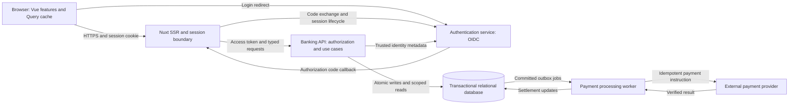
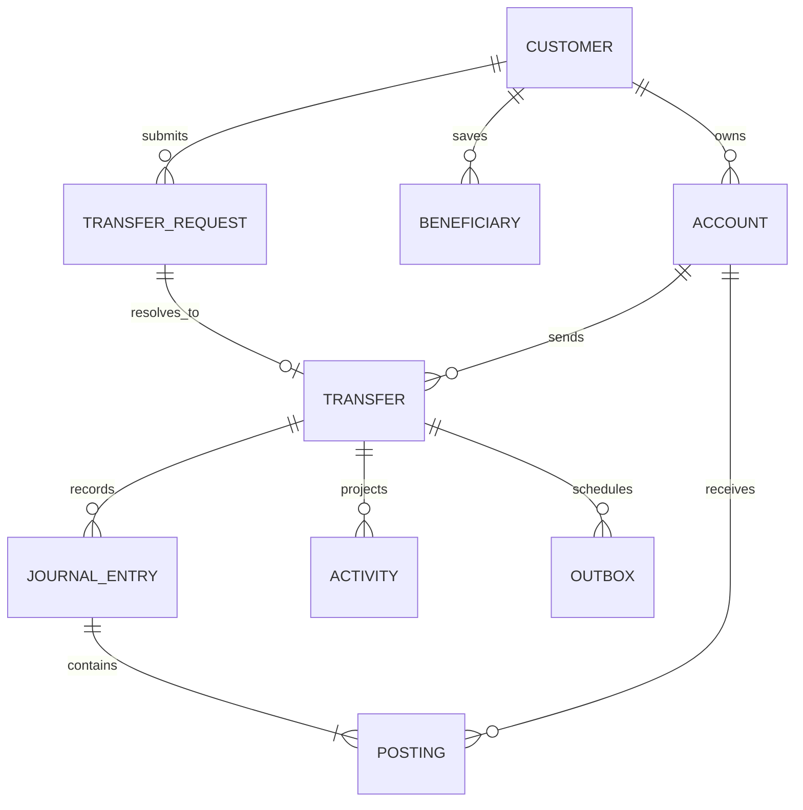

# Production banking architecture proposal

This is a design proposal, not implemented infrastructure. The running work sample uses Nuxt/Vue, browser MSW, a single IndexedDB snapshot and an assumed authenticated fictional customer. Its Nitro bridge forwards to a compatible backend but does not implement login, authorization, a production database or payment rails.

## Components and communication

The browser retains page/form state and an expendable API cache. Nuxt renders request-specific HTML, manages sessions and forwards authorized requests; it is not the source of monetary truth. The Banking API owns account permissions, validation, balances, transfer execution and activity. A relational database enforces durable constraints and transactional writes. External payment processing is a separate asynchronous responsibility.

## Identity and request flow

1. Nuxt initiates an OIDC authorization-code login with an authentication service, validates the response and creates a server-managed session. OIDC supplies authenticated identity on top of OAuth; an ID token is not a substitute for an API access token. Use an established OIDC client with state/nonce validation and provider-supported PKCE. [OpenID Connect Core](https://openid.net/specs/openid-connect-core-1_0.html).
2. Keep provider tokens server-side and use a Secure, HttpOnly session cookie in the browser. Define expiry, renewal, logout and revocation. The API validates its access-token issuer, audience, signature and expiry, then resolves customer identity from trusted claims rather than a caller-supplied customer ID.
3. Nuxt SSR forwards only that request's identity. Banking queries check resource ownership before filtering or returning data. Keep responses private/no-store and clear Vue Query on logout or identity change. The current proxy/payload tests demonstrate the transport boundary only.
4. Apply CSRF protection to cookie-authenticated mutations, including origin checks and a validated token. SameSite cookies are additional protection rather than the entire control. No state changes occur through GET. [OWASP CSRF prevention](https://cheatsheetseries.owasp.org/cheatsheets/Cross-Site_Request_Forgery_Prevention_Cheat_Sheet.html).
5. The browser submits a transfer with a stable request key. After server commit, the response contains a receipt and the client invalidates account/activity queries. A timeout remains an unknown result; the client can query durable request status or explicitly repeat the same key.

## Proposed persistence model

| Table                      | Main fields and constraints                                                                                                                                  |
| -------------------------- | ------------------------------------------------------------------------------------------------------------------------------------------------------------ |
| customers                  | `id` primary key; unique identity-provider issuer/subject pair; display profile.                                                                             |
| accounts                   | `id`, owner FK, type, currency, status; protected account identifier. A balance projection is maintained with ledger postings.                               |
| beneficiaries              | `id`, customer FK, display/bank identity, protected account identifier, optional internal account FK.                                                        |
| transfers                  | `id`, customer/source FKs, destination account or immutable recipient snapshot, amount/currency, reference, lifecycle status and timestamps.                 |
| transfer_requests          | Unique `(customer_id, idempotency_key)`; normalized payload fingerprint, transfer/result reference.                                                          |
| journal_entries / postings | Journal identity plus linked account postings in integer minor units; balanced entries per currency, with explicit clearing accounts for external movements. |
| activity                   | Customer-facing read projection tied to account, transfer and journal references; indexed by account/time and supported search dimensions.                   |
| outbox / audit_events      | Durable payment jobs written with the transfer; append-only operational/audit records with actor, action, request ID and timestamp.                          |

This schema adds concepts deliberately absent from the demo. It needs migrations, access controls, encryption/key management, backups and tested recovery. Never place raw tokens or full account identifiers in application logs.

## Transfer transaction and external settlement

For an internal transfer, authorize the source and resolve the destination, enforce the request-key constraint, lock affected account rows in a stable order, recheck status/currency/funds, then write the transfer, journal postings, balance projections, activity and audit record in one database transaction. Prevent negative balances and duplicate application at the database boundary. Return success after commit.

Select an isolation/locking strategy explicitly; a serializable database transaction can still abort and require retry of the entire transaction. Such server retries must preserve the request key and must not repeat external side effects. [PostgreSQL transaction isolation](https://www.postgresql.org/docs/current/transaction-iso.html).

External payments cannot atomically commit a database write and a remote payment-network result. Commit an outbox job with the accepted transfer, process it idempotently, verify provider callbacks and reconcile settlement separately. Define accepted, pending, settled, failed and reversed outcomes with appropriate ledger entries and customer messaging before exposing real funds. The demo's immediate external success is only its mock contract.

## Mapping from this work sample

| Existing boundary                 | Proposed production responsibility                                                                           |
| --------------------------------- | ------------------------------------------------------------------------------------------------------------ |
| `src/features`, `src/contracts`   | Reusable UI/query contracts, with durable pending-request recovery and authenticated session behavior added. |
| `server/api/[...path].ts`         | Extend the forwarding boundary with a complete session lifecycle and CSRF policy.                            |
| MSW handlers                      | Replace with the real Banking API; retain MSW/HTTP fixtures for deterministic tests.                         |
| Pure domain and transfer use case | Reuse rules where appropriate; move authoritative checks and money changes to the backend.                   |
| IndexedDB snapshot                | Replace with transactional relational storage, ledger projections and server-side idempotency.               |
| Fictional current customer        | Replace with authenticated identity and resource-level authorization.                                        |

Backend integration requires contract tests plus isolated authenticated end-to-end scenarios. The fixture suite does not prove compliance with a real bank API. See [backend handoff](nuxt-migration.md), [testing boundaries](testing.md) and the [architecture decisions](adr/001-feature-oriented-vue-architecture.md).
